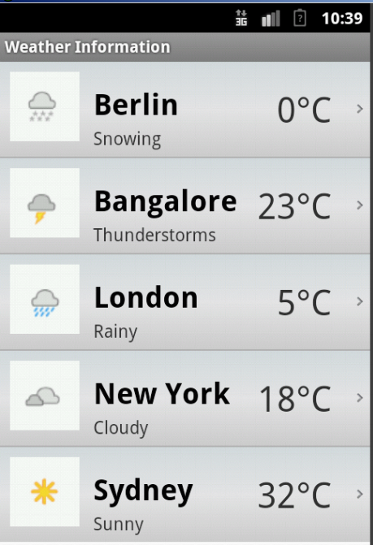
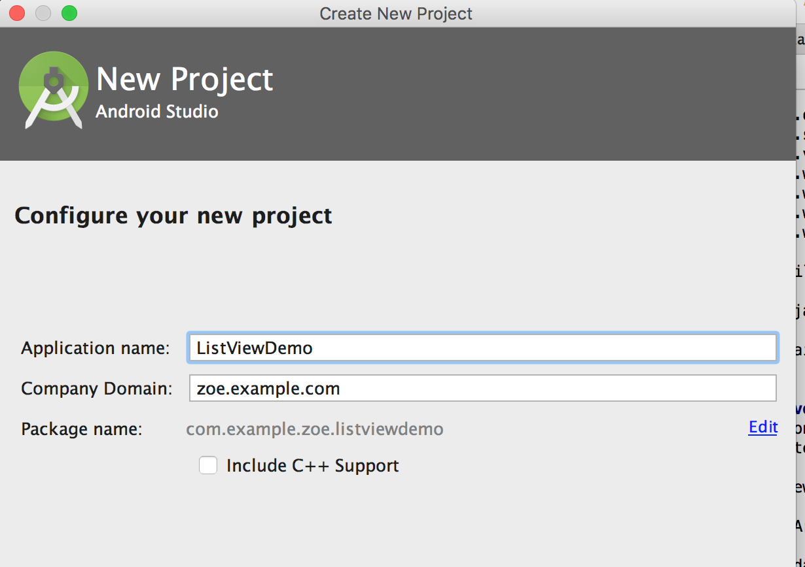
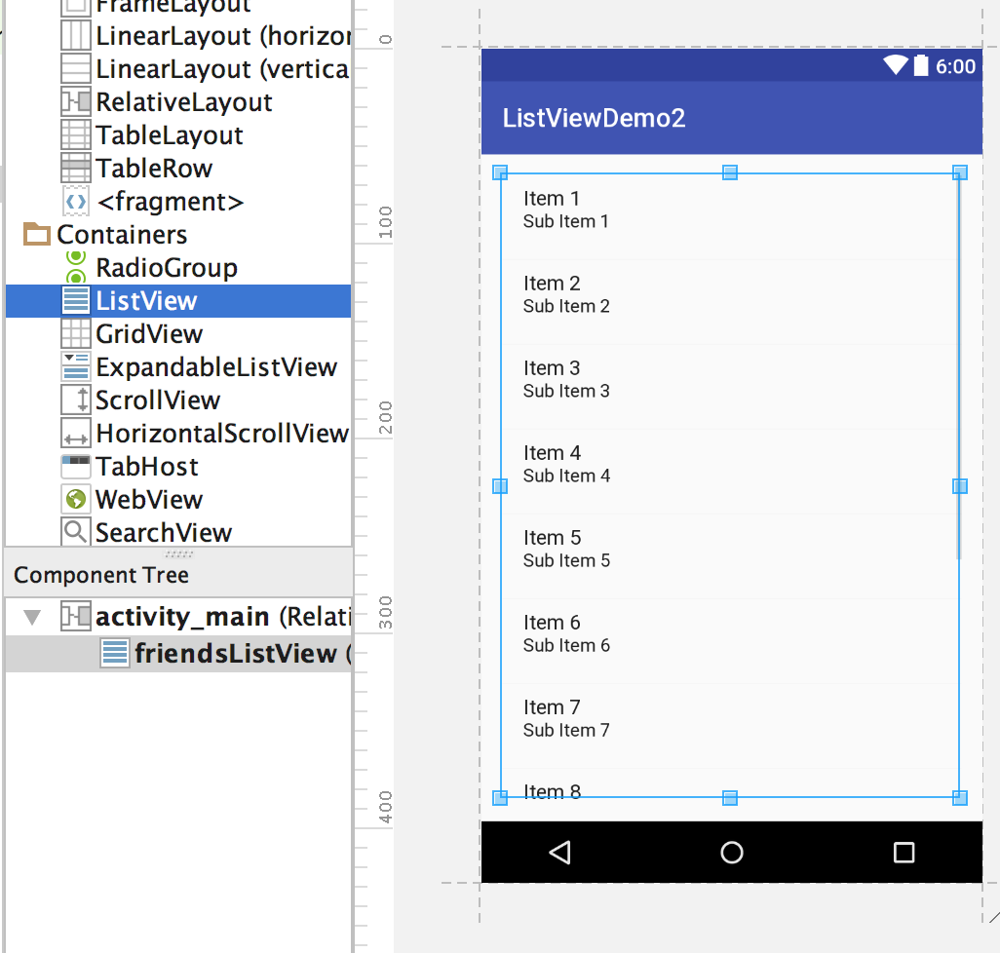
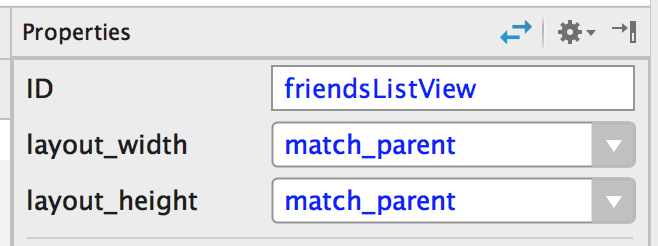
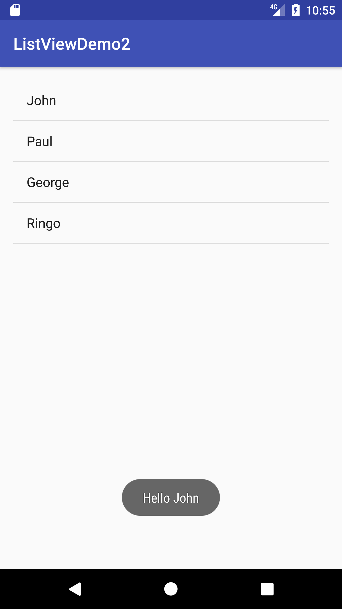

<h1>ListView</h1>


<p>Today, we're going to learn about a very powerful tool in Android: the ListView.  You've probably seen this before; whenever you scroll down a long list of items on an Android phone, you're using a ListView.  Below is an example of a weather app using a ListView.</p>


<br>
<br>
<p>To begin, first create an Android project.  I called mine ListViewDemo. </p>
<br>
<br>

<br>
<br>
<p>First, drag a ListView from the Palette on the side onto your view.</p>
<br>
<br>

<br>
<br>
<p>Next, set the id.  I set it to friendsListView, but you can set it to anything, as long as you remember it later.</p>
<p>You can also set the layout_width and layout_height to match_parent to ensure that the ListView takes up the entire screen. </p>
<br>
<br>



<p></p>
<p></p>


<p>In the code below, we're going to initialize our ListView and use findViewById to connect it to the ListView we created in our layout builder. </p>
<br>

```
ListView friendsListView = (ListView)findViewById(R.id.friendsListView);
```

<br>
<p>Next, create an ArrayList of Strings that we will display in the ListView.</p>

<br>

```
final ArrayList<String> myFriends = new ArrayList<String>(asList("John", "Paul", "George", "Ringo"));
```

<br>

<p>Then, create an ArrayAdapter that will specify the context (this), type of list item (simple_list_item_1), and ArrayList we want to display in the ListView.  Use "setAdapter" to set our ArrayAdapter as the adapter of the ListView. </p>

<br>


```
ArrayAdapter<String> arrayAdapter = new ArrayAdapter<String>(this, android.R.layout.simple_list_item_1, myFriends);
friendsListView.setAdapter(arrayAdapter);
```

<br>

<p>Next, we're going to set a method for clicking on each individual cell in the ListView.  </p>

<br>

<p>The Toast method displays text in a box near the bottom of the screen.  You can specify how long it will appear (Toast.LENGTH_LONG) and the text it will show ("Hello " + myFriends.get(position)).</p>

<br>


```
friendsListView.setOnItemClickListener(new AdapterView.OnItemClickListener() {
            @Override
            public void onItemClick(AdapterView<?> parent, View view, int position, long id) {
              Toast.makeText(getApplicationContext(), "Hello " + myFriends.get(position), Toast.LENGTH_LONG).show();
            }
        });
```

<br>
<br>


<p>The code below is the final code for MainActivity.class:</p>

<br>
<br>

```
public class MainActivity extends AppCompatActivity {

    @Override
    protected void onCreate(Bundle savedInstanceState) {
        super.onCreate(savedInstanceState);
        setContentView(R.layout.activity_main);

        ListView friendsListView = (ListView)findViewById(R.id.friendsListView);

        final ArrayList<String> myFriends = new ArrayList<String>(asList("John", "Paul", "George", "Ringo"));

        ArrayAdapter<String> arrayAdapter = new ArrayAdapter<String>(this, android.R.layout.simple_list_item_1, myFriends);

        friendsListView.setAdapter(arrayAdapter);

        friendsListView.setOnItemClickListener(new AdapterView.OnItemClickListener() {
            @Override
            public void onItemClick(AdapterView<?> parent, View view, int position, long id) {

                Toast.makeText(getApplicationContext(), "Hello " + myFriends.get(position), Toast.LENGTH_LONG).show();

            }
        });
    }
}
```

<br>
<br>

<br>
<br>
<p>Success!</p>
<br>
<br>

